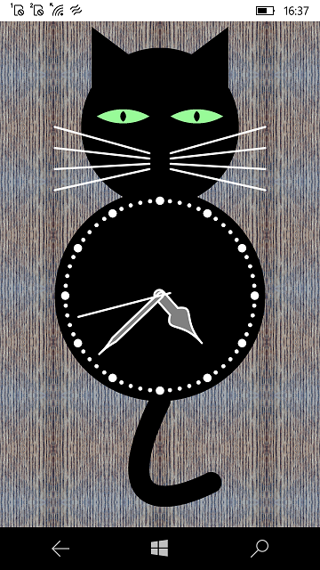

# CatClock

My CatClock multi-platform remake (special for Windows 10 Mobile). 

# About (Description)

"Cat Clock is a Xamarin.Forms application that demonstrates various features of SkiaSharp graphics. 

It runs on iOS, Android, and UWP via Skiasharp =)

## Screenshots

## More tech details about Cat Clock's architecture

SkiaSharp, powered by Google’s Skia graphics library, helps developers extend their Xamarin.Forms apps with compelling 2D graphics. Watch how Charles Petzold shows you how to include a SkiaSharp canvas in your Xamarin.Forms apps and make the most of the extensive and versatile SkiaSharp library.
 
In this session, you’ll: 
• Draw lines, curves, and graphics paths
• Fill areas with shaders
• Load and render bitmaps
• Apply graphics transforms 
• Animate 2D shapes and integrate with touch and other inputs

### "Magic Frameworks combo" for CatClock's architect deals: 
- .Net Standard 1.4 
- SkiaSharp" 1.60.0 (!)
- SkiaSharp.Views.Forms 1.60.0 (!!)
- Xamarin.Forms 4.7.0.968 (!!! Nonsense to me, it... supported 1.4??? Impossible... I ALWAYS used XF 2.5 as last good version.... idk what f..k happens!)

### Project type 

Sample/ PoC / Proto (please try to use it as "game template" for your own dev multi-platform micro-projects.)

### Used languages

C# (csharp)

### Used products (platforms):

"Xamarin", itself... and SkiaSharp  =)

## References
- [MS Learn University](https://learn.microsoft.com/en-us/samples/xamarin/xamarin-forms-samples/catclock/)
- [CatClock source code](https://github.com/xamarin/xamarin-forms-samples/tree/main/CatClock)
- [SkiaSharp Graphics for Xamarin Forms: Youtube webinar by Charles Petzold](https://www.youtube.com/watch?v=fF0tzA6wUhA)

## .
AS IS. No support. RnD only.

## ..
[m][e] 2022